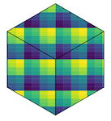

# `geohashTools`



[](https://app.codecov.io/gh/MichaelChirico/geohashTools?branch=master)
[](https://app.travis-ci.com/MichaelChirico/geohashTools)
[](https://cran.r-project.org/package=geohashTools)

This package provides tools for working with [Gustavo](https://github.com/niemeyer) [Niemeyer](https://twitter.com/gniemeyer)'s [geohash](https://en.wikipedia.org/wiki/Geohash) system of nestable, compact global coordinates based on [Z-order curves](https://en.wikipedia.org/wiki/Z-order_curve). The system consists of carving the earth into equally-sized rectangles (when projected into latitude/longitude space) and nesting this process recursively.

Originally, we adapted C++ source from [Hiroaki Kawai](https://github.com/hkwi), but have now rewritten the implementation completely with a new approach in C.

## Encoding geohashes

Encoding is the process of turning latitude/longitude coordinates into geohash strings. For example, Parque Nacional Tayrona in Colombia is located at roughly 11.3113917 degrees of latitude, -74.0779006 degrees of longitude. This can be expressed more compactly as:


```r
library(geohashTools)
gh_encode(11.3113917, -74.0779006)
```

```
## [1] "d65267"
```

These 6 characters identify this point on the globe to within 1.2 kilometers (east-west) and .6 kilometers (north-south).

The park is quite large, and this is too precise to cover the park; we can "zoom out" by reducing the precision (which is the number of characters in the output, `6` by default):


```r
gh_encode(11.3113917, -74.0779006, precision = 5L)
```

```
## [1] "d6526"
```

<!-- TODO(michaelchirico): restore this. Site appears to be down as of this CRAN submission, seemingly temporarily -->

### Public Art in Chicago

We can use this as a simple, regular level of spatial aggregation for spatial points data, e.g., counting presence of public art throughout the city of Chicago, as captured in a dataset

<!-- http s://data.cityofchicago.org/Parks-Recreation/Parks-Public-Art/sj6t-9cju -->

provided by the City:

NB: As of this writing, the Chicago data portal is down, apparently temporarily. However I'd like to submit this package update to CRAN in order to avoid deprecation issues around {rgdal} & co, so please check back on the website for a working version of the code below.


```r
## first, pull the data internally from https://data.cityofchicago.org
# api_stem = 'https://data.cityofchicago.org/api/views'
# URL = file.path(api_stem, 'sj6t-9cju/rows.csv?accessType=DOWNLOAD')

# suppressPackageStartupMessages(library(data.table))
# art = fread(URL)

# count art by geohash
# gh_freq = art[, .N, by = .(geohash = gh_encode(LATITUDE, LONGITUDE, 5L))]
# only show the top 10
# gh_freq[order(-N)][1:10]
```

This is pretty impractical _per se_ (where is `dp3wm`?); we'll return to this once we've introduced more functionality.

## Decoding geohashes

The reverse of encoding geohashes is of course decoding them -- taking a given geohash string and converting it into global coordinates. For example, the Ethiopian coffee growing region of Yirgacheffe is roughly at `sc54v`:


```r
gh_decode('sc54v')
```

```
## $latitude
## [1] 6.130371
## 
## $longitude
## [1] 38.21045
```

It can also be helpful to know just how precisely we've identified these coordinates; the `include_delta` argument gives the cell half-widths in both directions in addition to the cell centroid:


```r
gh_decode('sc54v', include_delta = TRUE)
```

```
## $latitude
## [1] 6.130371
## 
## $longitude
## [1] 38.21045
## 
## $delta_latitude
## [1] 0.02197266
## 
## $delta_longitude
## [1] 0.02197266
```

In terms of latitude and longitude, all geohashes with the same precision have the same dimensions (though the physical size of the "rectangle" changes depending on the latitude); as such it's easy to figure out the cell half-widths from the precision alone using `gh_delta`:


```r
gh_delta(5L)
```

```
## [1] 0.02197266 0.02197266
```

## Geohash neighborhoods

One unfortunate consequence of the geohash system is that, while geohashes that are lexicographically similar (e.g. `wxyz01` and `wxyz12`) are certainly close to one another, the converse is not true -- for example, `7gxyru` and `k58n2h` are neighbors! Put another way, small movements on the globe occasionally have visually huge jumps in the geohash-encoded output.

Fret not -- one tool for helping overcome this is the `gh_neighbors` function (`gh_neighbours` is also registered, for the Commonwealthy among us), which will return all of the geohashes adjacent to a given geohash (or vector of geohashes) at the same level of precision.

For example, the Merlion statue in Singapore is roughly at `w21z74nz`, but this level of precision zooms in a bit too far. The geohash neighborhood thereof can be found with:


```r
gh_neighbors('w21z74nz')
```

```
## $self
## [1] "w21z74nz"
## 
## $southwest
## [1] "w21z74nw"
## 
## $south
## [1] "w21z74ny"
## 
## $southeast
## [1] "w21z74pn"
## 
## $west
## [1] "w21z74nx"
## 
## $east
## [1] "w21z74pp"
## 
## $northwest
## [1] "w21z74q8"
## 
## $north
## [1] "w21z74qb"
## 
## $northeast
## [1] "w21z74r0"
```

## API to other GIS tools in R

`geohashTools` offers several helper functions for interfacing your geohash objects with GIS tools in R, namely `sp` and `sf`. This will facilitate the best part of working with GIS data -- the visualizations!

Returning to public art locations in Chicago, we can visualize the spatial aggregations carried out above by converting to `sp`, combining with a shapefile of Chicago, and plotting:


```r
library(sf)

## first, pull neighborhood shapefiles from https://data.cityofchicago.org
# tmp = tempfile(fileext = '.zip')
# shp_url = file.path(
#   api_stem, '9wp7-iasj', 'files',
#   'TMTPQ_MTmUDEpDGCLt_B1uaiJmwhCKZ729Ecxq6BPfM?filename=Neighborhoods_2012.zip'
# )
# download.file(shp_url, tmp)

# chicago = paste0('/vsizip/', tmp) |>
#   st_read(quiet = TRUE) |>
#   st_transform(crs = 4326L)

# artSF = gh_to_sf(
#   art[, .N, by = .(geohash = gh_encode(LATITUDE, LONGITUDE, 6L))],
#   gh_col = 'geohash'
# )
# plot(st_geometry(chicago), lwd = 0.5, main = 'Public Art Locations in Chicago')
# plot(artSF['N'], add = TRUE)
```

Chicago connoisseurs will recognize the biggest concentration around Lincoln Park, with another concentration along the waterfront near Millenium/Grant Parks.

The process for `sf` is similar; just replace `gh_to_spdf` with `gh_to_sf`.

# See also

You might get benefit out of these more interactive online tools for working with geohashes:

  - http://www.movable-type.co.uk/scripts/geohash.html
  - https://gofreerange.com/geohash-explorer
